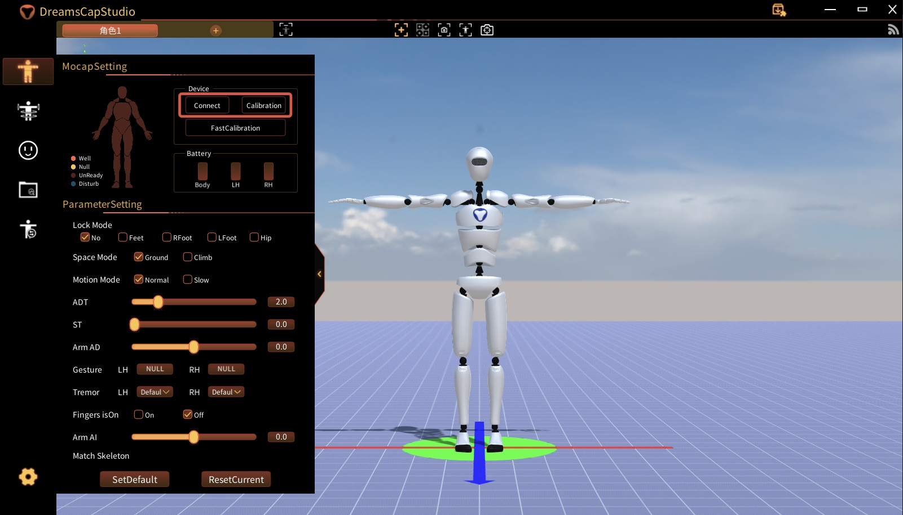
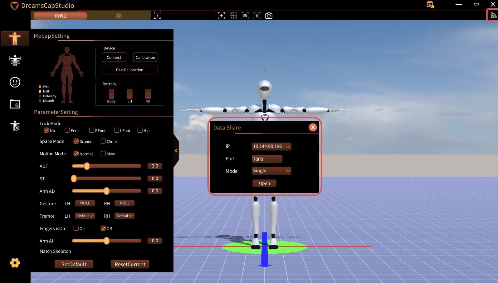

# VDMocap & VDHand Setup Guide

This document describes how to prepare VDMocap/VDHand for teleoperation in this repository, including device purchase, wearing, Windows-side software setup, and Linux-side config mapping.

## 1. Purchase and Wearing

### 1.1 Purchase Link

VDMocap/VDHand product page:

- https://vdsuit.com/h-pd-34.html

### 1.2 Wearing Guide

Please wear sensors and gloves according to the official wearing tutorial video.

- Wearing video: **TBD (placeholder, to be added later)**


## 2. Windows Software Installation and Setup

Use a **Windows PC** and connect the official hardware through USB.

### 2.1 Install Wi-Fi Driver

Download:

- https://drive.google.com/file/d/1SCIezEEy2k8YOBB9VjTMO7oKLXqWLQaV/view?usp=sharing

Steps:

1. Download the package.
2. Extract it.
3. Run the installer and finish the driver installation.

### 2.2 Install DreamsCapStudio

Download:

- https://drive.google.com/file/d/1480iz0yccpRhxriPuIlsLNuUNTlIVk-L/view?usp=sharing

Steps:

1. Download the package.
2. Extract it.
3. Launch `DreamsCapStudio`.

### 2.3 Power On, Connect, and Calibrate

1. Power on the devices.
2. Open `DreamsCapStudio`.
3. Click **Connect**.
4. Run **Calibration** (or **FastCalibration** if needed).

Reference screenshot:



### 2.4 Enable Data Broadcast (IP/Port)

1. In `DreamsCapStudio`, click the top-right broadcast icon.
2. Configure **IP** and **Port**.
3. Click **Open** to start broadcast.

Network requirement:

- Ensure the Linux machine and Windows machine are reachable on the same network
  - either same Wi-Fi
  - or wired LAN with reachable IPs

Reference screenshot:




## 3. Map Settings to `teleop.yaml`

After setting broadcast IP/Port in DreamsCapStudio, sync them into:

- `deploy_real/config/teleop.yaml` (`network.mocap` section)

Typical mapping in this repository:

- Body stream:
  - `network.mocap.body.ip`
  - `network.mocap.body.port`
  - `network.mocap.body.index`
- Hand stream:
  - `network.mocap.hand.ip`
  - `network.mocap.hand.port`
  - `network.mocap.hand.index`

Current config block location:

- `deploy_real/config/teleop.yaml` (`network.mocap.default/body/hand`)

Example (adjust to your own broadcast settings):

```yaml
network:
  mocap:
    body:
      ip: "192.168.1.111"
      port: 7000
      index: 0
    hand:
      ip: "192.168.1.111"
      port: 7000
      index: 1
```

If your DreamsCapStudio IP/port differs, update both body and hand entries accordingly.
